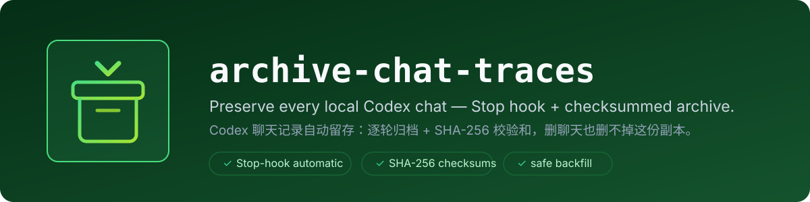

<p align="center">
  
</p>

<p align="center">
  
  
  
</p>

Automatically preserve local Codex chat transcripts in an independent archive.

Archive Chat Traces installs a user-level Codex `Stop` hook. After each
completed agent turn, the hook copies the current session JSONL to a private
archive directory and records a SHA-256 checksum. Deleting or archiving the
chat in Codex does not remove this independent copy.

> This is a community project and is not an official OpenAI project.

## Features

- Archives every future Codex chat after each completed turn.
- Backfills existing sessions, optionally filtered by model family.
- Preserves entire sessions when a historical model filter matches.
- Uses atomic writes and SHA-256 sidecars.
- Merges with existing user hooks instead of replacing them.
- Rejects transcript paths outside Codex session directories.
- Never copies `auth.json`, `.env`, or the complete Codex state directory.
- Supports status checks, checksum verification, and non-destructive uninstall.

## Requirements

- Codex CLI with lifecycle hooks enabled.
- Python 3.9 or later.
- macOS or Linux.

## Install

Clone the repository directly into the personal Codex skills directory:

```bash
git clone https://github.com/coderdailyone/archive-chat-traces.git \
  ~/.codex/skills/archive-chat-traces
```

Install the automatic hook and archive all existing Codex sessions:

```bash
python3 ~/.codex/skills/archive-chat-traces/scripts/install.py \
  install --backfill
```

To backfill only sessions that used GPT-5.6 while still archiving every future
chat, run:

```bash
python3 ~/.codex/skills/archive-chat-traces/scripts/install.py \
  install --backfill --backfill-model-prefix gpt-5.6
```

Restart Codex, enter `/hooks`, and trust the `Archiving chat transcript` hook.
Codex requires this one-time review for user-installed command hooks. The hook
will not run until it is trusted.

## Archive Location

The default archive is:

```text
~/CodexChatArchive/
├── manifest.jsonl
└── transcripts/
    ├── sessions/
    └── archived_sessions/
```

Each transcript keeps its path relative to the original Codex session
directory. A neighboring `*.meta.json` file records its byte size, checksum,
model, session ID, and archive timestamp.

Choose a different location during installation:

```bash
python3 ~/.codex/skills/archive-chat-traces/scripts/install.py install \
  --archive-dir /absolute/path/to/CodexChatArchive \
  --backfill
```

You can also set `CODEX_CHAT_ARCHIVE_DIR` for direct archive commands.

## Manage the Archive

Show hook and archive status:

```bash
python3 ~/.codex/skills/archive-chat-traces/scripts/install.py status
```

Verify all archived files against their SHA-256 metadata:

```bash
python3 ~/.codex/skills/archive-chat-traces/scripts/archive_trace.py verify
```

Backfill newly discovered sessions:

```bash
python3 ~/.codex/skills/archive-chat-traces/scripts/archive_trace.py backfill
```

Backfill a specific model family:

```bash
python3 ~/.codex/skills/archive-chat-traces/scripts/archive_trace.py backfill \
  --model-prefix gpt-5.6
```

## Update

Pull the latest version and reinstall the hook so its command points at the
current script:

```bash
git -C ~/.codex/skills/archive-chat-traces pull --ff-only
python3 ~/.codex/skills/archive-chat-traces/scripts/install.py install
```

Codex will ask you to review the hook again whenever its definition changes.

## Uninstall

Remove only this project's hook:

```bash
python3 ~/.codex/skills/archive-chat-traces/scripts/install.py uninstall
```

Uninstalling does not delete `~/CodexChatArchive` or any other configured
archive directory.

## What Is Preserved

Codex session JSONL may contain recorded user and assistant messages, tool
calls and results, model metadata, environment metadata, and returned reasoning
summaries. Treat the archive as sensitive data and back it up with encryption.

The archive cannot expose private hidden chain-of-thought. Encrypted or omitted
reasoning fields do not become readable by copying the transcript.

## Limitations

- `codex exec --ephemeral` does not create a persistent transcript.
- A process terminated before the `Stop` event remains only in Codex's normal
  session directory until the next backfill.
- Codex documents `transcript_path` as convenient hook input, but the JSONL
  format is not a stable public integration schema. Keep raw files unchanged
  and build derived indexes separately.
- This project creates an independent local copy, not an off-device backup.

## Development

Run the isolated tests and validate the skill:

```bash
PYTHONDONTWRITEBYTECODE=1 python3 scripts/test_archive_chat_traces.py
python3 ~/.codex/skills/.system/skill-creator/scripts/quick_validate.py .
```

The tests use temporary Codex and archive directories. They do not read or
modify real chat transcripts.

## License

MIT
